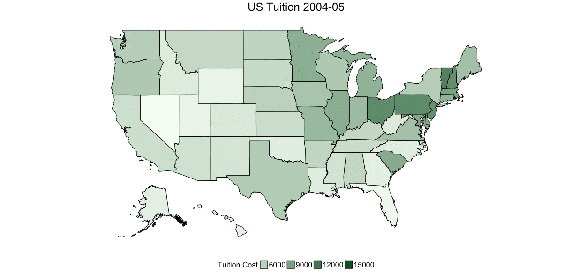

Tidy Tuesday - Week 1
================
Dana Paige Seidel (@dpseidel)

Investigating US Tuition Costs
------------------------------

[RAW DATA](https://github.com/rfordatascience/tidytuesday/blob/master/data/us_avg_tuition.xlsx)
[DataSource](https://onlinembapage.com/average-tuition-and-educational-attainment-in-the-united-states/)
[Original Graphic](https://onlinembapage.com/wp-content/uploads/2016/03/AverageTuition_Part1b.jpg)

``` r
data <- read_xlsx("../data/us_avg_tuition.xlsx")
data
```

    ## # A tibble: 50 x 13
    ##    State       `2004-05` `2005-06` `2006-07` `2007-08` `2008-09` `2009-10`
    ##    <chr>           <dbl>     <dbl>     <dbl>     <dbl>     <dbl>     <dbl>
    ##  1 Alabama         5683.     5841.     5753.     6008.     6475.     7189.
    ##  2 Alaska          4328.     4633.     4919.     5070.     5075.     5455.
    ##  3 Arizona         5138.     5416.     5481.     5682.     6058.     7263.
    ##  4 Arkansas        5772.     6082.     6232.     6415.     6417.     6627.
    ##  5 California      5286.     5528.     5335.     5672.     5898.     7259.
    ##  6 Colorado        4704.     5407.     5596.     6227.     6284.     6948.
    ##  7 Connecticut     7984.     8249.     8368.     8678.     8721.     9371.
    ##  8 Delaware        8353.     8611.     8682.     8946.     8995.     9987.
    ##  9 Florida         3848.     3924.     3888.     3879.     4150.     4783.
    ## 10 Georgia         4298.     4492.     4584.     4790.     4831.     5550.
    ## # ... with 40 more rows, and 6 more variables: `2010-11` <dbl>,
    ## #   `2011-12` <dbl>, `2012-13` <dbl>, `2013-14` <dbl>, `2014-15` <dbl>,
    ## #   `2015-16` <dbl>

Looking at this I can tell this is going to be ideal for a spatial plot. So I need some US states! Since it's through time I think I might also try to animate it with `gganimate`!

``` r
library(gganimate)

# get case to all lower for id to match 
data <- data %>% 
  mutate(id = tolower(State)) %>% 
  gather(year, cost, -id,- State)

# map_id creates the aesthetic mapping to the state name column in your data
p <- ggplot(data, aes(frame = year, map_id = id)) + 
  # map points to the fifty_states shape data
  geom_map(aes(fill = cost), color = "black", map = fifty_states) + 
  expand_limits(x = fifty_states$long, y = fifty_states$lat) +
  coord_map() +
  scale_x_continuous(breaks = NULL) + 
  scale_y_continuous(breaks = NULL) +
  labs(x = "", y = "") +
  theme(legend.position = "bottom", 
        panel.background = element_blank(), 
        plot.title = element_text(hjust = 0.5, size=24), 
        legend.text = element_text(size = 16), 
        legend.title = element_text(size = 16)) +
  guides(fill=guide_legend(title="Tuition Cost")) +
  ggtitle("US Tuition") +
  scale_fill_gradient(low = "#f7fcf5", high = "#005a32")
p

animation::ani.options(interval = 1)

gganimate(p, ani.width =  1250, ani.height = 585, "tuition.gif", title_frame = TRUE)
```


