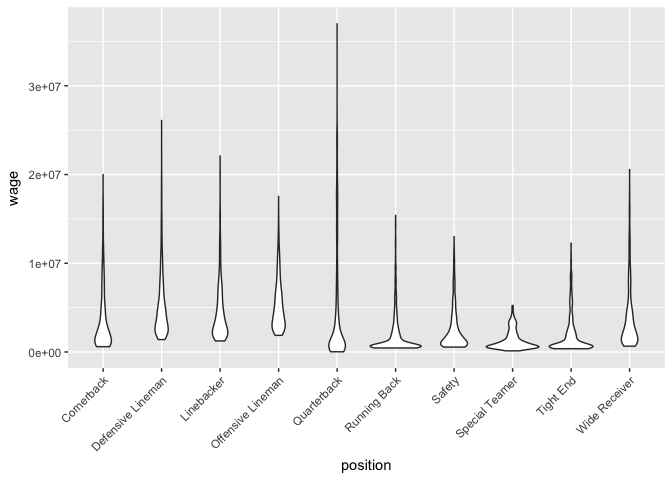
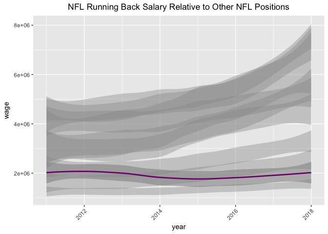

Tidy Tuesday - Week 2
================
Dana Paige Seidel

Exploring NFL Wages
-------------------

[RAW DATA](https://github.com/rfordatascience/tidytuesday/blob/master/data/tidy_tuesday_week2.xlsx)

[Article](https://fivethirtyeight.com/features/running-backs-are-finally-getting-paid-what-theyre-worth/)

[DatSource: Spotrac.com](http://www.spotrac.com/rankings/)

[Original Graphic](https://espnfivethirtyeight.files.wordpress.com/2017/05/morris-nflrb-1.png?w=575&h=488&quality=90&strip=info)

First thought is to try a violin plot:

``` r
tidy <- data %>% gather(position, wage, -year)

ggplot(tidy, aes(x=position, y = wage)) +
  theme(axis.text.x = element_text(angle = 45, hjust = 1)) +
  geom_violin(na.rm=TRUE)
```



This does show the lower median wage of runningbacks but ignores the variation through time and doesn't highlight the difference very well. FiveThirtyEight is definitely besting me.

Let's try something else:

``` r
# running back purple, everyone else blue #2b8cbe
# running back is #^
RB_pop_color <- set_names(c(terrain.colors(5), "#810f7c", terrain.colors(4)), unique(tidy$position))

ggplot(tidy, aes(x=year, y = wage, series = position))+
  theme(axis.text.x = element_text(angle = 45, hjust = 1),
        plot.title = element_text(hjust = .5)) +
  geom_smooth(linetype = 0, method ='loess', formula = 'y ~ x', na.rm = TRUE) +
  geom_smooth(data = filter(tidy, position == "Running Back"), color = "#810f7c", method ='loess', formula = 'y ~ x') +
  ggtitle("NFL Running Back Salary Relative to Other NFL Positions")
```



Simple. But effective!

If I had more time, I would play with making a more creative theme!
